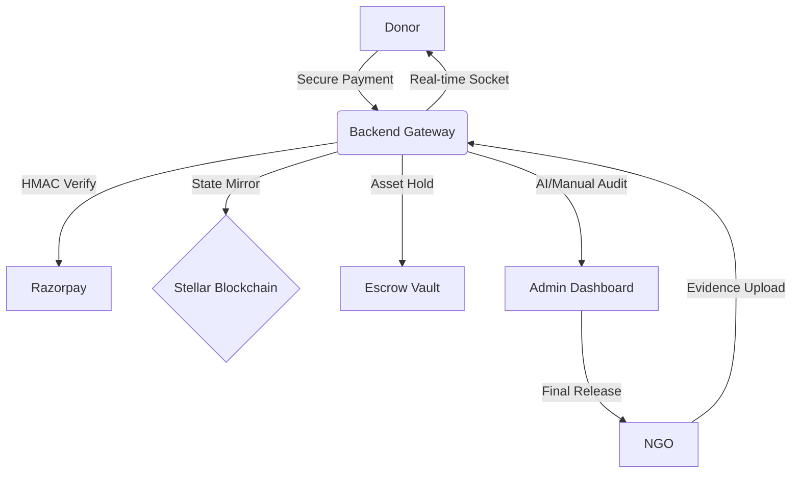
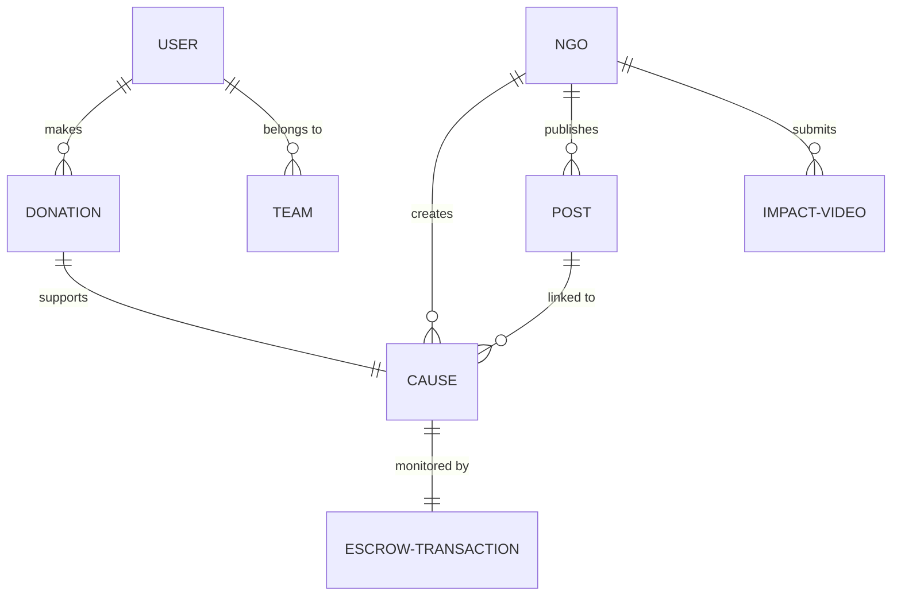

# 🌌 DonerHQ: The Celestial Ledger of Global Impact


<div align="center">

[](https://stellar.expert/explorer/testnet/)
[](https://github.com/Ronit178693/DonerHQ)
[](https://github.com/Ronit178693/DonerHQ)
[](https://github.com/Ronit178693/DonerHQ)

**Revolutionizing Philanthropy through Immutable Transparency and Algorithmic Engagement.**

[Explore the Code](https://github.com/Ronit178693/DonerHQ) • [Read the Handbook](file:///c:/Users/Lenovo/OneDrive/Desktop/Project/DonerHQ/donerhq_backend_handbook.md) • [Report Issues](https://github.com/Ronit178693/DonerHQ/issues)

</div>

---

## 💎 The Vision: Solving the "Transparency Deficit"

DonerHQ isn't just a donation site; it's a **High-Accountability Ecosystem**. It solves the industry's largest problem: *Donor Detachment*. By forcing a **Proof-of-Impact lifecycle**, we ensure that every rupee donated is cryptographically tracked from the wallet to the mission field.

### **The Trust Protocol**
1.  **Fund:** Donors support a mission using the Razorpay bridge.
2.  **Lock:** Funds enter an **Escrow Vault** — NGOs cannot access the capital yet.
3.  **Anchor:** The event is signed onto the **Stellar Blockchain** as an unalterable proof.
4.  **Verify:** NGOs must upload high-definition video evidence of the work in progress.
5.  **Disburse:** Administrative nodes verify the evidence and trigger the final fund release.

---

## 🛠️ The Technology Matrix

### **Frontend layer (The Ethereal Interface)**
| Technology | Role | Animation/Behavior |
| :--- | :--- | :--- |
| **React 19** | Core Architecture | Async rendering, High-speed navigation |
| **Framer Motion** | Orchestration | Orchestral transitions, staggered list entrance |
| **Zustand** | State Management | Atomic updates, persistent auth sessions |
| **Vanilla CSS** | Styling System | Bespoke Design Tokens, Glassmorphic UI |
| **Lucide React** | Iconography | Semantic, lightweight SVG vectors |

### **Backend Core (The Mission Engine)**
| Technology | Role | Implementation |
| :--- | :--- | :--- |
| **Node.js 22** | Runtime | Native ES Modules (`type: module`) |
| **Express 5** | Middleware | Integrated Async Error Handling |
| **MongoDB 9** | Intelligence | Formula-based feed ranking via FeedScore |
| **Socket.io** | Synchronization | Global event emitters for live donations |
| **Cloudinary** | Media Delivery | AI-managed image/video optimization |
| **Razorpay** | Liquidity | Two-phase HMAC-SHA256 verified payments |
| **Stellar SDK** | Immutability | Blockchain anchoring for financial audits |

---

## 🏗️ Technical Architecture & Workflows

### **1. The Hybrid-Decentralized Model**
DonerHQ uses a "Mirror-Ledger" strategy. All operational data is stored in MongoDB for speed, while all financial state changes are mirrored to the Stellar Blockchain for permanence.



### **2. Algorithmic Feed Ranking (The "For You" Logic)**
Our custom algorithm uses a 4-factor weighted scoring system to ensure donors see missions they actually care about:

| Factor | Weight | Signal |
| :--- | :--- | :--- |
| **Interest Match** | 35% | Intersection of User Interests & Post Tags |
| **Relationship** | 30% | Direct Following & Past Donation History |
| **Trending** | 20% | (Likes + DonateClicks × 3) / Age in Hours |
| **Recency** | 15% | Linear decay over a 72-hour window |

---

## 🛡️ Enterprise-Grade Security

We treat security as a first-class citizen, not an afterthought:

*   **🔐 JWT-in-Cookie:** Authentication tokens are stored in `httpOnly`, `secure`, `SameSite: Strict` cookies. This makes the platform immune to XSS-based token theft.
*   **💳 HMAC Payment Verification:** Every donation is verified through a server-side HMAC-SHA256 signature generated using a private Razorpay secret. Fake payment requests are impossible.
*   **🛡️ Role-Gating:** Middleware-driven authorization ensures only verified NGOs can post, and only admins can touch the Escrow Vault.
*   **🧹 Smart Cleanup:** Multer-Cloudinary pipeline uses `fs.unlinkSync` to ensure no temporary sensitive files ever leak or persist on the server disk.
*   **⏳ FeedScore TTL:** Algorithmic scores auto-expire every 30 minutes via MongoDB TTL indexes, keeping the database lean and performant.

---

## 📊 Database Schema Design



---

## 📂 Engineering Structure

```text
DonerHQ/
├── Client/                 # React Frontend (Vite)
│   ├── src/
│   │   ├── api/            # Axios instance with VITE_API_URL interceptors
│   │   ├── components/
│   │   │   ├── guards/     # ProtectedRoute & Role Gating
│   │   │   ├── layout/     # Navbar, Footer, Glassmorphic Wrappers
│   │   │   └── ui/         # Atomic UI Components
│   │   ├── pages/          # 13 Core Page Modules (Auth, Feed, Teams, etc.)
│   │   └── stores/         # Zustand: authStore, feedStore
├── Server/                 # Node.js Backend
│   ├── src/
│   │   ├── config/         # Multi-provider setup (DB, Cloud, Razor, Stellar)
│   │   ├── controllers/    # Business Logic (40+ handlers)
│   │   ├── models/         # 8 Mongoose Schemas (User, NGO, Cause, etc.)
│   │   ├── routes/         # Semantic REST Endpoints
│   │   └── socket.js       # WebSocket Singleton
│   └── scripts/            # Database Seeding & Maintenance
└── donerhq_backend_handbook.md # The COMPLETE technical reference
```

---

## ⚡ Quick Deployment

### **1. Infrastructure Provisioning**
Configure your `.env` in the `/Server` root with:
```bash
# Core
PORT=5000
MONGO_URI=your_mongodb_atlas_string

# Auth & Secrets
JWT_SECRET=your_32_character_secret
EMAIL_USER=your_gmail_for_otps
EMAIL_PASS=your_app_password

# External Integrations
RAZORPAY_KEY_ID=rpay_id
RAZORPAY_KEY_SECRET=rpay_secret
CLOUDINARY_CLOUD_NAME=name
CLOUDINARY_API_KEY=key
CLOUDINARY_API_SECRET=secret
STELLAR_SECRET_KEY=SB... # Testnet
STELLAR_PUBLIC_KEY=GA...  # Testnet
```

### **2. Ignition Sequence**
```bash
# Start the Backend
cd Server
npm install
npm run dev

# Start the Frontend
cd Client/Client
npm install
npm run dev
```

---

## 🌌 The Future: Multi-Chain Impact
DonerHQ is evolving beyond a simple platform. We are building the future of **Social Philanthropy**, where every donation creates a ripple of verified good that is visible to the entire world, forever.

---

<div align="center">
Designed with ❤️ for <b>DonerHQ Community</b><br/>
<i>Immutable. Transparent. Celestial.</i>
</div>