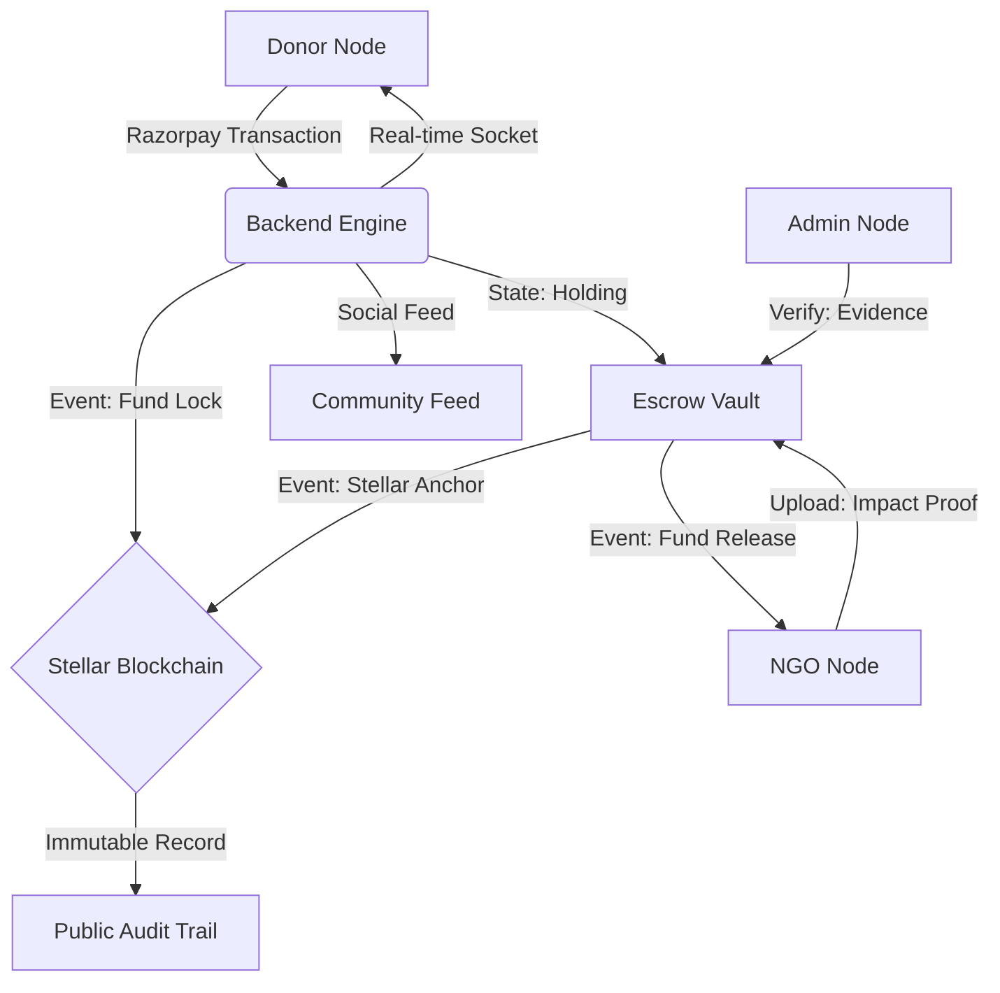

# 🌌 DonerHQ: The Celestial Ledger of Global Impact


[](https://stellar.expert/explorer/testnet/)
[](https://github.com/Ronit178693/DonerHQ)
[](https://github.com/Ronit178693/DonerHQ)

**DonerHQ** is a high-fidelity, hybrid-decentralized fundraising ecosystem designed to solve the "Trust Multiplier" problem in global philanthropy. By anchoring critical financial events onto the **Stellar Blockchain** and utilizing a sophisticated **Escrow Governance** model, DonerHQ ensures that every rupee donated is tracked, verified, and immutably recorded from the moment of intent to the point of impact.

---

## 💎 The Core Philosophy: "Proof of Impact"

In traditional fundraising, donors lose visibility the moment they click "Pay". DonerHQ bridges this gap using the **Celestial Ledger** system:

*   **🔒 Immutable Anchoring:** Every fund hold and release event generates a cryptographic signature on the Stellar Testnet.
*   **🎥 Evidence-Based Release:** Funds are held in escrow and only released to NGOs once proof-of-work (Impact Videos) is uploaded and verified by administrative nodes.
*   **🔮 Real-Time Synchronization:** Socket.io powered feeds ensure that you see the impact as it happens, not weeks later.

---

## 🛠️ The Tech Stack

### **Frontend: The Ethereal Interface**
Built with a focus on **Glassmorphism** and a "Celestial Ledger" aesthetic.
*   **React 19 (Vite):** Blazing fast rendering and HMR.
*   **Framer Motion:** High-end orchestral animations and micro-interactions.
*   **Zustand:** Atomic state management for zero-latency UI updates.
*   **Vanilla CSS:** Pure design control with a bespoke design system (Tokens for Spacing, Colors, and Typography).
*   **Lucide & Material Symbols:** Semantic iconography for a professional feel.

### **Backend: The Secure Core**
*   **Node.js (Next-Gen ES Modules):** Modern modular architecture.
*   **Express 5:** High-performance API routing.
*   **MongoDB (Mongoose):** Flexible document storage for complex social interactions.
*   **Socket.io:** Real-time bi-directional event engine for live donation tracking.
*   **Razorpay:** Integrated industrial-grade payment gateway.
*   **Cloudinary:** Decentralized media delivery for impact videos and NGO assets.

### **Blockchain Layer: Immutable Trust**
*   **Stellar SDK:** Direct integration with the Stellar Horizon server.
*   **Horizon Network:** Anchoring platform events as un-alterable blockchain transactions.

---

## 🏗️ System Architecture



---

## 🚀 Key Feature Breakdown

### **1. Donor Ecosystem**
*   **Personal Dashboard:** Real-time visibility into all active and completed missions.
*   **Escrow Ledger:** A dedicated tab showing the exact status of your money (Holding, Released, or Verification Pending).
*   **Trust Badges:** Direct links to **StellarExpert** for every transaction to verify the blockchain proof.
*   **Leaderboard:** Precision ranking based on verified financial throughput and platform engagement.

### **2. NGO Control Center**
*   **Mission Deployment:** NGOs can launch verified missions with specific categories and goals.
*   **Impact Pipeline:** A stage-gated workflow for uploading video evidence and triggering fund release.
*   **Social Connectivity:** Post updates, photos, and videos to the global feed to drive engagement.
*   **Analytics Hub:** Comprehensive data on reach, donation clicks, and donor retention.

### **3. Admin Master Protocol**
*   **Organization Clearance:** Manual verification of NGO nodes (80G, FCRA documentation review).
*   **Impact Verification Vault:** Admins review raw video evidence before authorizing capital disbursement.
*   **Global Liquidity Monitoring:** Real-time oversight of the platform's active escrow volume.

---

## 🛡️ Security & Engineering

*   **HTTP-Only Cookies:** JWT tokens stored in non-scriptable browser memory to prevent XSS attacks.
*   **Bcrypt Encryption:** Salting and hashing of all user passwords with 10 rounds of entropy.
*   **CORS Whitelisting:** Strict origin validation for all API requests.
*   **Atomic Transactions:** Utilizing Mongoose sessions where needed to ensure database integrity during financial state changes.
*   **Stellar Anchoring:** Prevents centralized "state hacking" by mirroring critical ledger points on a public blockchain.

---

## 📂 Project Structure

```text
DonerHQ/
├── Client/                 # React Frontend (Vite)
│   ├── src/
│   │   ├── api/            # Axios instance & interceptors
│   │   ├── components/     # UI, Layout, & Route Guards
│   │   ├── pages/          # All 13 core page modules
│   │   └── stores/         # Zustand state management
│   └── public/             # Static assets
├── Server/                 # Node.js Backend
│   ├── src/
│   │   ├── config/         # DB, Cloudinary, Razorpay, Stellar setup
│   │   ├── controllers/    # Domain-driven business logic
│   │   ├── middlewares/    # Auth & Role-based authorization
│   │   ├── models/         # Mongoose Schemas (User, NGO, Cause, etc.)
│   │   ├── routes/         # RESTful API endpoints
│   │   └── socket.js       # Real-time event orchestration
│   └── scripts/            # Database initialization & seeding utilities
└── donerhq_backend_handbook.md # Comprehensive API documentation
```

---

## ⚡ Quick Start

### **Environmental Calibration**
Create a `.env` file in the `/Server` directory with the following variables:
```env
PORT=5000
MONGO_URI=your_mongodb_uri
JWT_SECRET=your_auth_secret
CLOUDINARY_CLOUD_NAME=name
CLOUDINARY_API_KEY=key
CLOUDINARY_API_SECRET=secret
RAZORPAY_KEY_ID=rpay_key
RAZORPAY_KEY_SECRET=rpay_secret
STELLAR_SECRET_KEY=SB... (Testnet Secret)
STELLAR_PUBLIC_KEY=GA... (Testnet Public)
EMAIL_USER=your_gmail
EMAIL_PASS=your_app_password
CLIENT_URL=http://localhost:5173
```

### **Execution Hooks**
1. **Infrastructure Spawn:**
   ```bash
   cd Server
   npm install
   npm run dev
   ```
2. **Interface Projection:**
   ```bash
   cd Client/Client
   npm install
   npm run dev
   ```

---

## 🌌 The Vision
DonerHQ is more than a crowdfunding platform; it is a **Decentralized Trust Network**. In a world of increasing financial opacity, we use technology to force transparency, ensuring that empathy always finds its way to the actual impact.

---

Designed with ❤️ for **Ronit178693/DonerHQ**
*(Refining the UX of Global Philanthropy)*