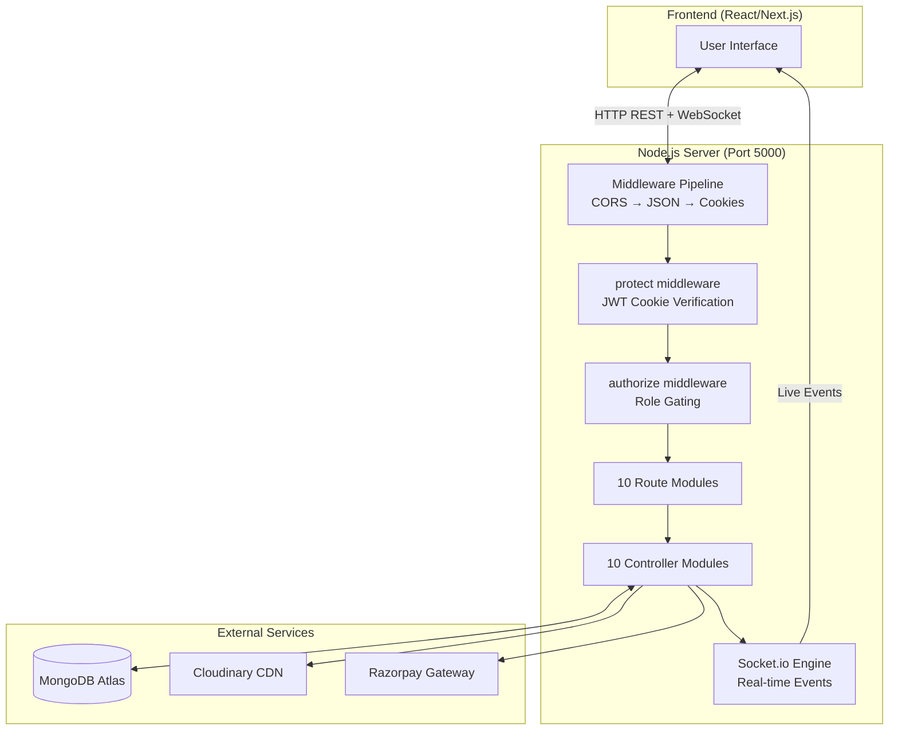
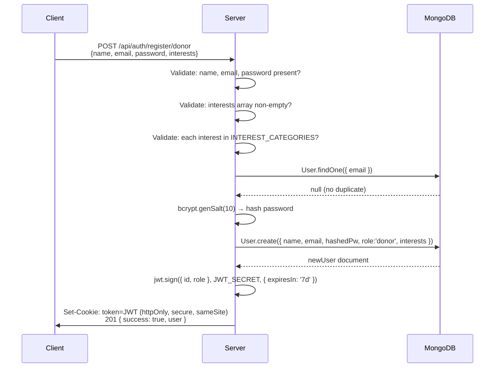
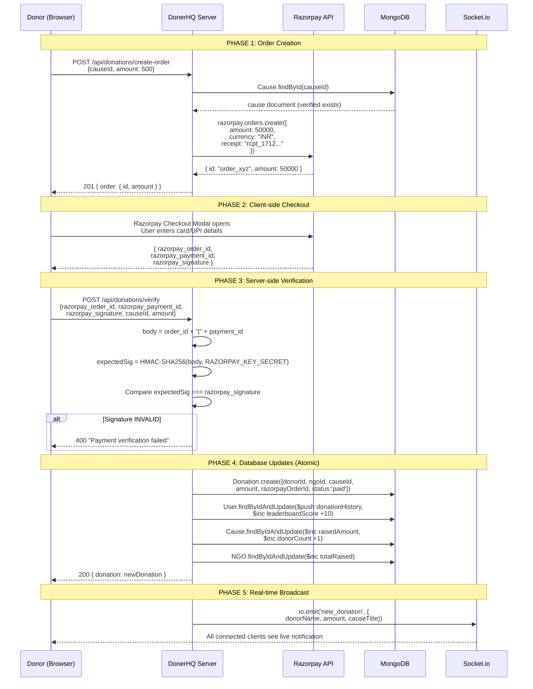
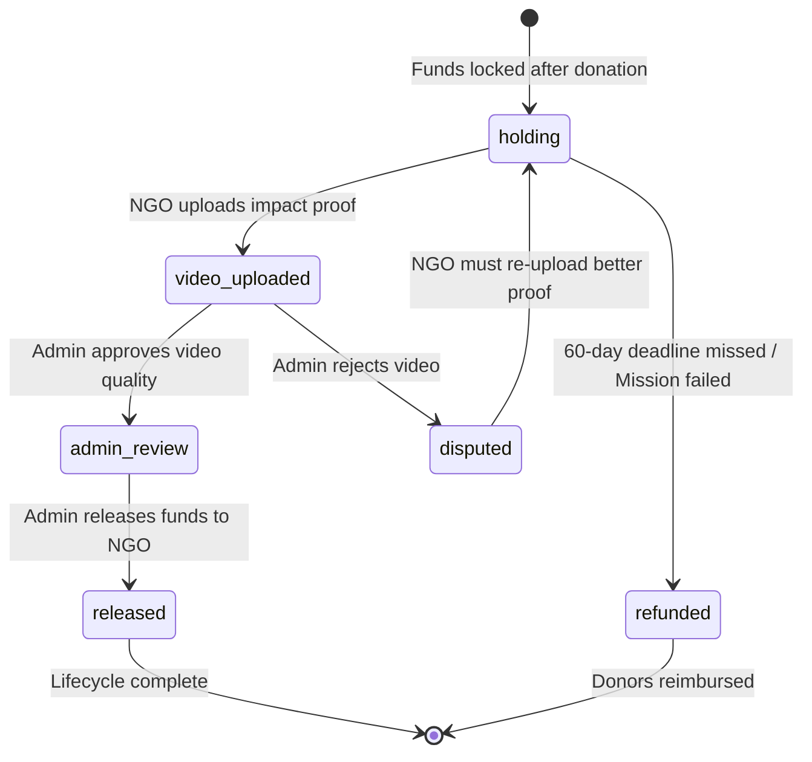

# 📘 DonerHQ Backend — Complete Engineering Handbook

> **Version:** 2.0 · **Last Audited:** April 2, 2026  
> **Stack:** Node.js · Express 5 · MongoDB (Mongoose 9) · Razorpay · Cloudinary · Socket.io  
> **Pattern:** MVC-inspired modular architecture using ES Modules (`"type": "module"`)

---

## 1. What is DonerHQ?

DonerHQ is a **high-accountability donation platform** that solves the #1 problem in online charity: **"Where did my money actually go?"**

Unlike generic donation sites, DonerHQ forces NGOs into a **transparency lifecycle**:
1. Donors fund a specific mission (Cause).
2. Money is **locked in escrow** — the NGO cannot touch it.
3. The NGO must **upload a video** proving they used the funds as promised.
4. An **admin reviews** the video and either releases or disputes the funds.
5. Donors can see **exactly** where their money went.

The platform also has a full **social layer** (like Instagram for charity) with algorithmic feeds, likes, comments, shares, a leaderboard, and team-based fundraising.

---

## 2. Architecture Overview



**Why Express 5?** It has native async error handling — no need for `express-async-handler` wrappers.  
**Why Cookie-based JWT?** httpOnly cookies can't be read by JavaScript (immune to XSS), unlike `localStorage` Bearer tokens.  
**Why Mongoose over raw MongoDB driver?** Schema validation, middleware hooks (like the NGO `pre('save')` auto-sync), and population make relational-style queries trivial.

---

## 3. Directory Structure

```
Server/
├── package.json                  # 12 dependencies, ES Modules enabled
├── src/
│   ├── server.js                 # Express + HTTP + Socket.io entry point
│   ├── socket.js                 # Real-time WebSocket singleton
│   ├── config/
│   │   ├── db.js                 # MongoDB connection with smart error diagnostics
│   │   └── razorpay.js           # Razorpay SDK initialization
│   ├── middlewares/
│   │   ├── auth.middleware.js    # JWT cookie → req.user
│   │   ├── role.middleware.js    # Role-based access control
│   │   └── multer.js             # File upload (10MB, images+videos)
│   ├── models/                   # 8 Mongoose schemas
│   │   ├── User.js, NGO.js, Post.js, Cause.js
│   │   ├── Donation.js, EscrowTransaction.js
│   │   ├── ImpactVideo.js, Team.js, FeedScore.js
│   ├── controllers/              # 10 business logic modules (40+ functions)
│   ├── routes/                   # 10 route files (1:1 with controllers)
│   └── utils/
│       └── cloudinary.js         # Upload + temp-file cleanup
```

---

## 4. System Workflows (Interview-Ready)

### 4.1 🔐 Authentication System

**Design Decision:** We use **httpOnly cookies** instead of Bearer tokens stored in localStorage. This is because cookies with the `httpOnly` flag cannot be accessed by client-side JavaScript, making them immune to XSS attacks. The `SameSite` flag prevents CSRF. This is the gold standard for web authentication security.

#### Donor Registration Flow


**Interview Q: "Why 10 salt rounds for bcrypt?"**  
A: 10 rounds is the sweet spot — it takes ~100ms to hash, which is fast enough for UX but slow enough to make brute-force attacks impractical (an attacker would need ~100ms × millions of attempts).

**Interview Q: "Why store interests at registration?"**  
A: These power our feed algorithm from day one. Without them, a new user would see a blank feed (the "cold start" problem). By collecting interests during onboarding, we can immediately show relevant content.

#### NGO Registration Flow
Same as donor, but with **two extra steps**:
1. **Multer extracts files** — `upload.fields([{name:'logo'}, {name:'doc80G'}, {name:'docFCRA'}])` processes multipart form data and saves files to `/tmp`.
2. **Cloudinary upload** — Each file is uploaded to Cloudinary CDN, and the temp file is deleted. The secure URLs are stored in the NGO document.
3. **Two documents created** — A `User` (for auth) AND an `NGO` (for the org profile), linked by `userId ↔ ngoProfile`.
4. **Status: 'pending'** — The NGO cannot post or create causes until an admin calls `POST /api/auth/admin/verify-ngo`.

#### Login Flow
```
Client → POST /api/auth/login { email, password }
  → Server finds user by email (with .select('+password') to include hidden field)
  → Server populates ngoProfile (if role is 'ngo')
  → bcrypt.compare(inputPassword, storedHash) → true/false
  → If match: sign JWT, set cookie, return user
  → If no match: 401 "Invalid email or password"
```

**Interview Q: "Why does the error say 'Invalid email or password' instead of 'Wrong password'?"**  
A: Security best practice — never tell an attacker WHICH field is wrong. If you say "wrong password," they know the email exists and can focus on cracking that account.

#### Password Reset Flow (OTP-based)
```
Step 1: POST /api/auth/password-reset-otp { email }
  → Generate 6-digit code: Math.floor(100000 + Math.random() * 900000)
  → SHA-256 hash the code (never store plain OTP in DB)
  → Save hashedOTP + expiry (10 min) to user document
  → In production: send via email. In dev: return in response.

Step 2: POST /api/auth/reset-password { email, otp, newPassword }
  → SHA-256 hash the provided OTP
  → Compare with stored hash + check expiry
  → If valid: bcrypt hash new password, clear OTP fields, save
```

**Interview Q: "Why hash the OTP before storing?"**  
A: If the database is breached, attackers would see plain OTPs and could reset anyone's password. Hashing prevents this — same principle as password hashing.

---

### 4.2 💳 Payment Integration System (Razorpay)

This is a **two-phase commit** pattern: first create an order, then verify the payment. This prevents fake donations.

#### Complete Payment Workflow


**Interview Q: "Why not just trust the frontend's payment confirmation?"**  
A: Never trust the client. A user could intercept the request and send `amount: 1` while claiming they paid ₹10,000. The HMAC signature verification proves that Razorpay's servers actually processed the exact amount. The signature is generated using our SECRET key, which only lives on our server — impossible to forge from the client.

**Interview Q: "Why convert amount × 100?"**  
A: Razorpay uses the **smallest currency unit** (paise for INR). ₹500 = 50,000 paise. This avoids floating-point precision issues (e.g., ₹49.99 would be 4999 paise, not 49.99).

**Interview Q: "What happens if the server crashes between creating the Donation and updating the Cause?"**  
A: This is a valid concern — we're doing 4 separate DB writes, not a transaction. In production, we'd wrap this in a **Mongoose session with transactions** (`session.startTransaction()`). Currently, each `$inc` is atomic individually, so partial updates are possible but unlikely.

**Interview Q: "Why use `$inc` instead of reading the amount and saving?"**  
A: **Race condition prevention.** If 100 users donate simultaneously, a read-modify-write pattern could lose updates. `$inc` is an atomic MongoDB operation — it modifies the value directly on the database server without needing to read it first. It's the database equivalent of a thread-safe increment.

---

### 4.3 🏦 Escrow & Accountability System

This is DonerHQ's **core differentiator**. Money doesn't go directly to NGOs — it's held in escrow until proof is provided.

#### Complete Escrow Lifecycle


#### Step-by-Step Walkthrough
```
1. HOLD FUNDS (POST /api/escrow/hold)
   → After a Cause reaches its goal, funds are locked.
   → Creates EscrowTransaction: { causeId, ngoId, totalHeld, status: 'holding' }
   → Sets a 60-day videoDeadline for the NGO.
   → If escrow already exists for this cause, just $inc the totalHeld.

2. NGO UPLOADS PROOF (POST /api/impact-videos/upload)
   → NGO uploads a video file via Multer → Cloudinary.
   → Creates ImpactVideo: { causeId, ngoId, videoUrl, adminStatus: 'pending' }
   → Updates Cause.escrowStatus → 'video_uploaded'
   → Updates EscrowTransaction.status → 'video_uploaded'

3. ADMIN REVIEWS (POST /api/impact-videos/approve/:id)
   → Admin sets status to 'approved' or 'rejected'
   → If APPROVED:
     - Cause.escrowStatus → 'admin_review'
     - EscrowTransaction.status → 'admin_review'
   → If REJECTED:
     - Cause.escrowStatus → 'holding' (reset)
     - EscrowTransaction.status → 'disputed'
     - Admin can add a note explaining why

4. RELEASE FUNDS (POST /api/escrow/release/:id)
   → Requires status === 'video_uploaded' OR admin override
   → EscrowTransaction: status → 'released', released = totalHeld
   → Cause.escrowStatus → 'released'
   → In production: trigger actual bank transfer via Razorpay Route

5. OR CANCEL/REFUND (POST /api/escrow/cancel/:id)
   → EscrowTransaction.status → 'refunded'
   → Cause.escrowStatus → 'refunded'
   → In production: trigger reverse payments to each donor
```

**Interview Q: "Why not just send money directly to the NGO?"**  
A: Trust. India has thousands of registered NGOs, but many lack proper accountability. By requiring video proof before releasing funds, we give donors confidence that their money was actually used. It's like how Upwork holds freelancer payments in escrow until the client approves the work.

**Interview Q: "How do you prevent the NGO from uploading a fake video?"**  
A: The admin review step. A dedicated admin watches the video, checks timestamps, location metadata, and whether the activity matches the Cause description. In a future version, we could add AI-based content verification.

---

### 4.4 📱 Social Feed & Engagement System

DonerHQ has an **Instagram-like social layer** where NGOs post updates and donors interact.

#### Post Creation Flow (NGO only)
```
1. NGO clicks "Create Post" → Frontend sends POST /api/posts/create
   with multipart form: { type, caption, tags, linkedCauseId, media file }

2. Multer middleware extracts the file → saves to /tmp/uploads/

3. Controller checks:
   a. Does this user have an NGO profile? (NGO.findOne({userId}))
   b. Is the NGO status 'approved'? (Prevents unverified NGOs from posting)
   c. Is a media file present for photo/video types?

4. Cloudinary upload: uploadOnCloudinary(req.file.path) → secure_url

5. Post.create({ ngoId, type, mediaUrl, caption, tags, linkedCauseId })

6. NGO.findByIdAndUpdate($push: { posts: newPost._id })
   → This maintains a reference array for the NGO profile page
```

#### Interaction System (Like/Comment/Share/DonateClick)
All four actions go through a **single unified endpoint**: `POST /api/posts/interact`

```
Request: { postId: "abc123", action: "like" }

→ LIKE (toggle):
  - Check post.likedBy.includes(userId)
  - If already liked: $inc likes -1, $pull likedBy userId  (UNLIKE)
  - If not liked:    $inc likes +1, $addToSet likedBy userId (LIKE)

→ COMMENT:
  - Requires { text } in body
  - $push comments { userId, text, createdAt }
  - $inc commentCount +1

→ SHARE:
  - $inc shares +1 (simple counter)

→ DONATE_CLICK:
  - $inc donateClicks +1
  - This tracks how many people clicked "Donate" from a post
  - Used in the feed ranking algorithm as a conversion signal
```

**Interview Q: "Why a single endpoint instead of separate routes?"**  
A: Cleaner API surface. The frontend only needs to know one URL and pass an `action` field. It also lets us add new interaction types (e.g., `bookmark`, `report`) without creating new routes. This is the **Command Pattern** — a single handler that dispatches to different logic based on the command type.

**Interview Q: "Why `$addToSet` instead of `$push` for likes?"**  
A: `$addToSet` only adds the value if it doesn't already exist in the array, preventing duplicate likes. `$push` would allow the same user to like a post multiple times.

---

### 4.5 🧠 Feed Ranking Algorithm

We have **three feed endpoints** (a deliberate design choice for different contexts):

| Endpoint | Algorithm | Use Case |
|----------|-----------|----------|
| `GET /api/users/feed` | Following + interests | Simple "Following" tab |
| `GET /api/posts/` | Following + interestTags | "Discover" tab |
| `GET /api/feed/` | 4-factor weighted scoring | "For You" tab (recommended) |

#### The Scoring Engine (`computeScores` function)
```
Input: All posts from the last 72 hours
Output: Personalized score (0.0 → 1.0) for each post

For each post:
┌─────────────────────────────────────────────────────────┐
│ FACTOR 1: Interest Match (35% weight)                   │
│ → Compare post.tags with user.interests                 │
│ → Any overlap? Score = 1.0. No overlap? Score = 0.0     │
│ → Binary signal: "Is this post about something I care   │
│   about?"                                               │
├─────────────────────────────────────────────────────────┤
│ FACTOR 2: Relationship (30% weight)                     │
│ → user.following includes post.ngoId? → 1.0             │
│ → user has ANY donation history? → 0.5                  │
│ → Neither? → 0.0                                        │
│ → "Do I have a connection with this NGO?"               │
├─────────────────────────────────────────────────────────┤
│ FACTOR 3: Trending (20% weight)                         │
│ → hoursOld = (now - post.createdAt) / 3600000           │
│ → score = min(1.0, (likes + donateClicks×3) / hours/10) │
│ → donateClicks weighted 3x because conversions matter   │
│   more than passive likes                               │
├─────────────────────────────────────────────────────────┤
│ FACTOR 4: Recency (15% weight)                          │
│ → score = 1.0 - (hoursOld / 72)                         │
│ → Linear decay: brand new = 1.0, 72h old = 0.0          │
└─────────────────────────────────────────────────────────┘

Final = (Interest × 0.35) + (Relationship × 0.30) 
      + (Trending × 0.20) + (Recency × 0.15)
```

#### Performance Optimizations
- **FeedScore TTL Index**: Scores auto-delete from MongoDB after 30 minutes. No cron jobs needed.
- **Cold Start Logic**: If a user has zero scores and requests page 1, we compute scores synchronously on the first call, then cache them.
- **Batch Operations**: `FeedScore.deleteMany()` clears old scores, `FeedScore.insertMany()` writes the new batch — only 2 DB operations regardless of post count.

**Interview Q: "Why not use MongoDB's built-in `$sort` instead of pre-computing scores?"**  
A: Because the score depends on the **user's personal data** (interests, following list). MongoDB can't sort by a formula that references a different collection. We pre-compute and cache to avoid running this expensive per-user calculation on every feed scroll.

---

### 4.6 👥 Team Fundraising System

Teams let donors pool their impact and compete on a leaderboard.

#### Team Lifecycle
```
1. CREATE TEAM: POST /api/teams/create { name: "Delhi Donors" }
   → Check: user already in a team? Block (1 team per user rule)
   → Generate inviteLink: crypto.randomBytes(6).toString('hex') → "a1b2c3d4e5f6"
   → Team.create({ name, createdBy: userId, members: [userId], inviteLink })
   → User.findByIdAndUpdate({ $set: { teamId } })

2. JOIN TEAM: POST /api/teams/join { inviteLink: "a1b2c3d4e5f6" }
   → Team.findOne({ inviteLink }) → validate code
   → Check: user already in a team? Block
   → team.members.push(userId), user.teamId = team._id

3. LEAVE TEAM: POST /api/teams/leave
   → Creator CANNOT leave (must disband instead)
   → Regular members: filter out from members array, clear user.teamId

4. VIEW DASHBOARD: GET /api/teams/:id
   → Populated member list with names, scores, and streaks
```

**Interview Q: "Why crypto.randomBytes instead of UUID?"**  
A: We need a short, shareable invite code — "a1b2c3d4e5f6" is 12 characters that fit in a WhatsApp message. UUIDs are 36 characters with dashes. `crypto.randomBytes(6)` gives us 6 bytes = 2^48 possible codes = 281 trillion combinations, which is more than enough.

---

### 4.7 📂 File Upload Pipeline

Every file upload follows the same 3-step journey:

```
Browser → Multer (temp save) → Cloudinary (permanent CDN) → Cleanup

Step 1: MULTER MIDDLEWARE
  → diskStorage saves to ./public/temp/ 
  → fileFilter: only allows image/* and video/* MIME types
  → limits: { fileSize: 10 * 1024 * 1024 } (10MB max)
  → Rejects with 400 if wrong type or too large

Step 2: CLOUDINARY UPLOAD (in controller)
  → uploadOnCloudinary(localFilePath)
  → Uses cloudinary.uploader.upload() with resource_type: "auto"
  → Returns { secure_url, public_id, format, bytes }

Step 3: CLEANUP
  → fs.unlinkSync(localFilePath) removes the temp file
  → Even on upload failure, temp file is cleaned up
```

**Where files are uploaded:**
| Module | Field Name | Multer Config |
|--------|-----------|---------------|
| NGO Registration | `logo`, `doc80G`, `docFCRA` | `upload.fields([...])` (3 files) |
| NGO Profile Update | `logo` | `upload.single('logo')` |
| Post Creation | `media` | `upload.single('media')` |
| Cause Creation | `coverImage` | `upload.single('coverImage')` |
| Impact Video | `video` | `upload.single('video')` |

---

### 4.8 🔌 Real-Time Engine (Socket.io)

**Architecture:** Singleton pattern — `socket.js` exports `initSocket(server)` and `getIO()`.

```
server.js:
  const server = http.createServer(app)  ← wraps Express
  initSocket(server)                      ← attaches Socket.io
  server.listen(5000)                     ← single port for HTTP + WS

Any controller:
  import { getIO } from '../socket.js'
  getIO().emit('event', data)             ← broadcasts to all clients
  getIO().to(roomId).emit('event', data)  ← broadcasts to specific room
```

#### Room-Based Subscriptions
```
Client: socket.emit("join_cause", "causeId123")
Server: socket.join("causeId123")
  → Now this client receives events targeted at this cause
  → Use case: Live progress bar updates on a cause page
```

**Interview Q: "Why Socket.io instead of Server-Sent Events?"**  
A: SSE is one-directional (server → client). We need bidirectional communication — clients need to `emit('join_cause')` to subscribe to specific rooms. Socket.io also handles reconnection, binary data, and room management out of the box.

---

## 5. Complete API Reference

### Auth (`/api/auth`) — 9 endpoints
| Method | Endpoint | Auth | Role | Description |
|--------|----------|:----:|:----:|-------------|
| POST | `/register/donor` | ❌ | — | Register with interests quiz |
| POST | `/register/ngo` | ❌ | — | Register with file uploads |
| POST | `/login` | ❌ | — | Universal login (all roles) |
| POST | `/password-reset-otp` | ❌ | — | Request 6-digit OTP |
| POST | `/reset-password` | ❌ | — | Reset with OTP proof |
| POST | `/logout` | ✅ | Any | Clear JWT cookie |
| GET | `/me` | ✅ | Any | Current session profile |
| POST | `/admin/verify-ngo` | ✅ | Admin | Approve/reject NGO |
| GET | `/admin/pending-ngos` | ✅ | Admin | List pending NGOs |

### Users (`/api/users`) — 10 endpoints
| Method | Endpoint | Auth | Description |
|--------|----------|:----:|-------------|
| GET | `/leaderboard` | ❌ | Top 100 donors by score+streak |
| GET | `/profile/:id` | ❌ | Public profile (no email/password) |
| PUT | `/profile` | ✅ | Update name/interests/tags |
| POST | `/follow` | ✅ | Follow NGO `{ ngoId }` |
| POST | `/unfollow` | ✅ | Unfollow NGO |
| GET | `/feed` | ✅ | Following+interests feed |
| POST | `/save-ngo` | ✅ | Bookmark NGO |
| POST | `/unsave-ngo` | ✅ | Remove bookmark |
| GET | `/wishlist` | ✅ | Get bookmarked NGOs |
| GET | `/recommendations` | ✅ | AI-powered cause suggestions |

### NGOs (`/api/ngos`) — 10 endpoints
| Method | Endpoint | Auth | Role | Description |
|--------|----------|:----:|:----:|-------------|
| GET | `/discover` | ❌ | — | Browse with category/location/search filters |
| GET | `/:id` | ❌ | — | Full NGO profile |
| GET | `/:id/posts` | ❌ | — | NGO's social posts |
| GET | `/:id/causes` | ❌ | — | NGO's fundraising missions |
| POST | `/:id/follow` | ✅ | Any | Follow NGO |
| POST | `/:id/unfollow` | ✅ | Any | Unfollow NGO |
| PUT | `/:id` | ✅ | NGO | Update profile + logo |
| POST | `/posts/create` | ✅ | NGO | Create social post |
| DELETE | `/posts/:postId` | ✅ | NGO | Delete own post |
| GET | `/dashboard/analytics` | ✅ | NGO | Creator analytics dashboard |

### Posts (`/api/posts`) — 4 endpoints
| Method | Endpoint | Auth | Role | Description |
|--------|----------|:----:|:----:|-------------|
| GET | `/:id` | ❌ | — | Post detail (increments reach) |
| GET | `/` | ✅ | Any | Personalized feed |
| POST | `/interact` | ✅ | Any | like/comment/share/donateClick |
| POST | `/create` | ✅ | NGO | Create post with media upload |

### Causes (`/api/causes`) — 3 endpoints
| Method | Endpoint | Auth | Role | Description |
|--------|----------|:----:|:----:|-------------|
| GET | `/` | ❌ | — | Browse causes with filters |
| GET | `/:id` | ❌ | — | Cause detail with NGO info |
| POST | `/create` | ✅ | NGO | Create cause (verified NGOs only) |

### Donations (`/api/donations`) — 4 endpoints
| Method | Endpoint | Auth | Description |
|--------|----------|:----:|-------------|
| POST | `/create-order` | ✅ | Initialize Razorpay checkout |
| POST | `/verify` | ✅ | Verify signature + commit to DB |
| GET | `/history` | ✅ | Role-filtered transaction history |
| GET | `/:id` | ✅ | Individual transaction receipt |

### Teams (`/api/teams`) — 5 endpoints
| Method | Endpoint | Auth | Description |
|--------|----------|:----:|-------------|
| GET | `/:id` | ❌ | Team dashboard + members |
| POST | `/create` | ✅ | Create team with invite code |
| POST | `/join` | ✅ | Join via invite code |
| POST | `/leave` | ✅ | Leave team (creator blocked) |
| PUT | `/:id/settings` | ✅ | Update team name (creator only) |

### Escrow (`/api/escrow`) — 4 endpoints
| Method | Endpoint | Auth | Description |
|--------|----------|:----:|-------------|
| GET | `/status/:causeId` | ❌ | Public transparency dashboard |
| POST | `/hold` | ✅ | Lock funds in escrow |
| POST | `/release/:id` | ✅ | Release to NGO (admin/video required) |
| POST | `/cancel/:id` | ✅ | Cancel and mark for refund |

### Impact Videos (`/api/impact-videos`) — 3 endpoints
| Method | Endpoint | Auth | Description |
|--------|----------|:----:|-------------|
| GET | `/` | ❌ | Browse approved impact videos |
| POST | `/upload` | ✅ | NGO uploads proof video |
| POST | `/approve/:id` | ✅ | Admin reviews video |

### Algorithmic Feed (`/api/feed`) — 2 endpoints
| Method | Endpoint | Auth | Description |
|--------|----------|:----:|-------------|
| GET | `/` | ✅ | Get 4-factor ranked feed |
| POST | `/refresh` | ✅ | Re-compute scores (pull-to-refresh) |

---

## 6. Data Models — Quick Reference

| Model | Purpose | Key Fields | Indexes |
|-------|---------|-----------|---------|
| **User** | All accounts | role, interests, following, streak, leaderboardScore | — |
| **NGO** | Organization profiles | status, verified, transparencyScore, followerCount | category, status |
| **Post** | Social content | type, likes, likedBy, comments, shares, donateClicks, reach | createdAt, tags |
| **Cause** | Fundraising missions | goalAmount, raisedAmount, escrowStatus, donorCount | ngoId |
| **Donation** | Transaction records | amount, razorpayOrderId, razorpayPaymentId, status | — |
| **EscrowTransaction** | Fund safety | totalHeld, released, status (6 states), videoDeadline | — |
| **ImpactVideo** | Proof of impact | videoUrl, adminStatus, adminNote | — |
| **Team** | Fundraising groups | inviteLink, members, totalDonated | createdBy |
| **FeedScore** | Algorithm cache | score, reasons, **TTL: 30 min auto-delete** | userId, createdAt (TTL) |

---

## 7. Security Architecture

### Middleware Chain
```
Request → CORS (origin whitelist) → express.json() → cookieParser()
  → protect (JWT verify) → authorize (role check) → Controller
```

### Cookie Configuration
| Flag | Production | Development | Why |
|------|-----------|-------------|-----|
| httpOnly | ✅ | ✅ | Blocks JavaScript from reading the token (XSS protection) |
| secure | ✅ | ❌ | Forces HTTPS-only transport (localhost doesn't use HTTPS) |
| sameSite | `none` | `strict` | `none` allows cross-origin in prod (frontend ≠ backend domain) |
| maxAge | 7 days | 7 days | Session duration matching JWT expiry |

### CORS Policy
- **Allowed origins:** `localhost:5173`, `localhost:3000`, `process.env.CLIENT_URL`, `*.vercel.app`
- **Credentials:** `true` (required for cookies to be sent cross-origin)
- **No-origin requests allowed:** `true` (for Postman / server-to-server calls)

---

## 8. Environment Variables

```env
PORT=5000                          # Server port
NODE_ENV=development               # Controls cookie security flags
CLIENT_URL=http://localhost:5173   # Frontend origin for CORS
MONGO_URI=mongodb+srv://...        # MongoDB Atlas connection string
JWT_SECRET=your_secret_key         # JWT signing key (min 32 chars recommended)
RAZORPAY_KEY_ID=rzp_test_xxx       # Razorpay public key
RAZORPAY_KEY_SECRET=xxx            # Razorpay secret (for HMAC verification)
CLOUDINARY_CLOUD_NAME=xxx          # Cloudinary account
CLOUDINARY_API_KEY=xxx             # Cloudinary public key
CLOUDINARY_API_SECRET=xxx          # Cloudinary secret
```

---

## 9. Interview Cheat Sheet — Common Questions

| Question | Answer |
|----------|--------|
| "What's the tech stack?" | Node.js + Express 5, MongoDB with Mongoose 9, Razorpay payments, Cloudinary CDN, Socket.io real-time |
| "How do you handle auth?" | JWT stored in httpOnly cookies. 7-day expiry. bcrypt with 10 salt rounds. Role-based middleware (donor/ngo/admin) |
| "How do payments work?" | Two-phase: create Razorpay order → verify HMAC-SHA256 signature → atomically update 4 collections |
| "What makes this different?" | Escrow system. Money is locked until NGOs upload video proof, reviewed by admin. Full transparency |
| "How does the feed work?" | 4-factor algorithm: Interest Match (35%) + Relationship (30%) + Trending (20%) + Recency (15%). Cached with 30-min TTL |
| "How do you prevent race conditions?" | All counters use MongoDB atomic operators: `$inc`, `$addToSet`, `$pull`. No read-modify-write patterns |
| "How do you handle file uploads?" | Multer → temp disk → Cloudinary CDN → cleanup. 10MB limit, image/video MIME filter |
| "What's the real-time feature?" | Socket.io singleton. Emits `new_donation` events globally. Room-based subscriptions for cause-specific updates |
| "How do you handle errors?" | Try-catch in every controller. Global error middleware returns 500. Smart DB connection diagnostics in db.js |
| "What would you improve?" | Add Mongoose transactions for payment flow, Zod input validation, Winston logging, rate limiting, and automated tests |

---

> **Total: 10 modules · 8 models · 54 endpoints · 40+ controller functions**  
> Built with atomic operations, escrow accountability, and a 4-factor algorithmic feed.
